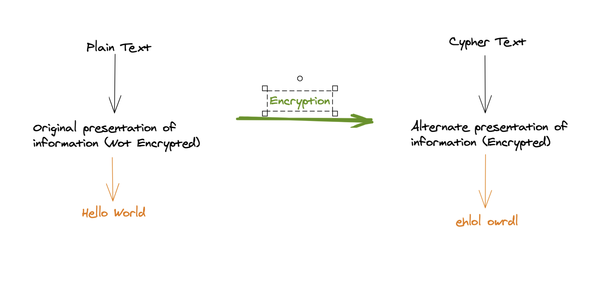
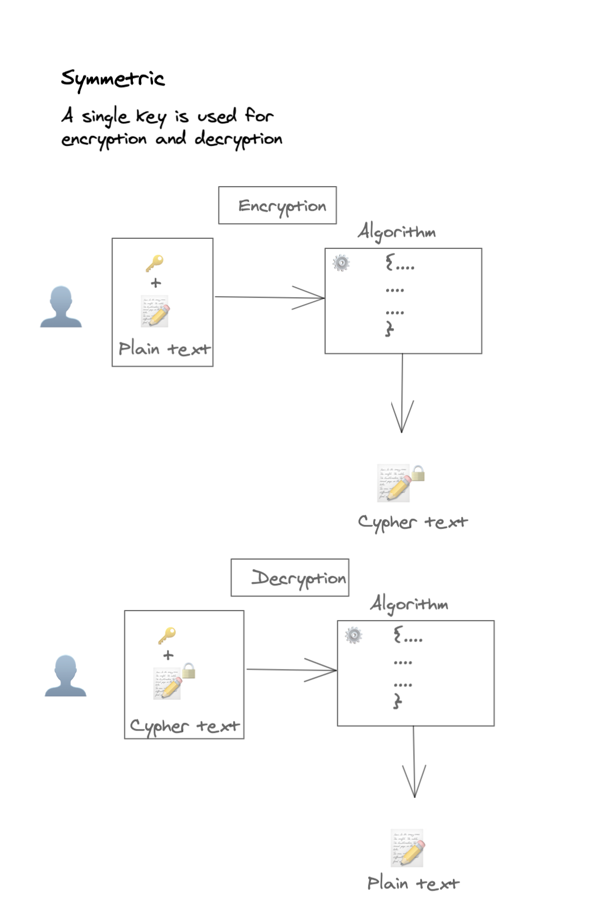
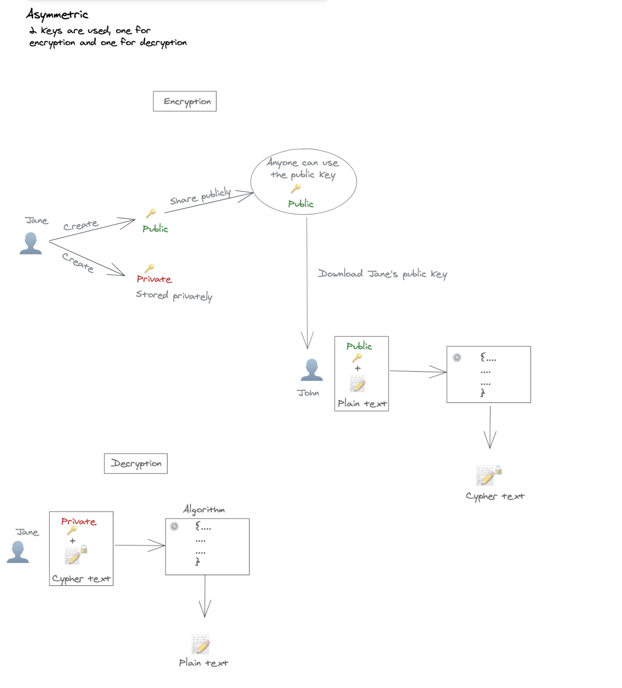

# Encryption refresher

We don't usually revisit and discuss Encryption (at least at a low level) much. Usually, Encryption and Decryption are abstracted through libraries, methods and protocols we use. However, last week, I had the chance to look at a feature that required a bit of work around Encryption and had to refresh my knowledge a bit. So I thought it could be an opportunity to share the learnings.

This post will go over some theory around Encryption and use some examples to provide more clarity.

## What is Encryption?
Encryption is the process that converts information into an alternative form that hides the true meaning of that information. Encryption has been there a long time before computers to facilitate secret communication. Rearranging the order of the letters in a message is a typical example of cryptography (the study of Encryption, Decryption, etc.) - `Hello World` could become `ehlol owrdl`. Another example is the usage of invisible ink (More info on the history of Cryptography can be found [here](https://en.wikipedia.org/wiki/Cryptography#History_of_cryptography_and_cryptanalysis)).


In the computers world, the "Hello World" example would look as follows:

We used a simple algorithm that would alternate the given text and display it in an unreadable format in the previous image. Here's the algorithm in javascript:
```
const reverseString = (str) => {
    if (str === "") {
        return "";
    }

    return reverseString(str.substring(1)) + str.charAt(0);
}

const encrypt = (text) => {
    // Get each word of the provided text
    const words = text.split(' ');

    // Convert each word in the array
    const convertedWords = words.map((word) => {
        const middleIndex = Math.floor(word.length / 2);

        // Get the letter in the middle after splitting the word length by 2, so that we concatenate it after converting each half separately
        let middleLetter = '';
        if (word.length % 2) {
            middleLetter = word[middleIndex];
        }

        // Get first half of the word and reverse it
        const firstHalfReversed = reverseString(word.slice(0, middleIndex));
        // Get second half of the word and reverse it
        const secondHalfReversed = reverseString(word.slice(middleIndex + 1));

        return firstHalfReversed + middleLetter + secondHalfReversed;
    })

    return convertedWords.join(' ');
}

const encryptedText = encrypt('hello world')
console.log(encryptedText) // ehlol owrdl
```

However, this is not very efficient, as any person knowledgeable in writing code would reverse that algorithm and decrypt the cypher text. Hence, a key is usually used as part of the Encryption algorithms. So an algorithm would need the plain text and a key to perform the Encryption. Think of a key as a password.

## We need a Key!
Alright, we know what is a key, and we visualised it as a password, but who provides this key?

### Symmetric Encryption
Assume two persons wanting to exchange some information securely without other humans having the ability to read them. They could agree on a key and algorithm to use and store it on both their computers. Before sending that data, the sender uses the key and the algorithm and generates the cypher text. When the receiver receives the cypher text, they use the key and the algorithm (or a reversed version) to decrypt that data. 

There is a slight problem here. How to share the key?
What if somebody intercepted that communication and stole the key; this would give the interceptor the ability to decrypt any future data. They could exchange the key physically on a piece of paper, but that restricts the sharing operation by the location of these individuals.

This is called symmetric Encryption, where the same key is used for both encryption and decryption processes. It is a good way of Encryption for local data on the computer but not efficient when transferring data between machines.

Some examples of symmetric encryption algorithms include:
* AES (Advanced Encryption Standard)
* DES (Data Encryption Standard)
* IDEA (International Data Encryption Algorithm)
* Blowfish (Drop-in replacement for DES or IDEA)


### Asymmetric Encryption
As the symmetric encryption method is not very practical for data transfer, since securing the key itself is a bit problematic, we could use the Asymmetric Encryption method for this type of operations. This Encryption type uses two keys: a public key and a private key.

For two persons (Jane and John) to exchange data in an encrypted manner, both need to agree on an algorithm and generate public and private keys.

The public key is used to encrypt the data (from plain text to cypher text) - Cannot decrypt that generated cypher text. Only the associated private key can decrypt that data.

How could these two-person transfer data between each other?
* Jane could share her public key publicly, and there is no risk in doing that; anyone who obtain that public key can only use it to encrypt data, which can only be decrypted by Jane's private key (the private key needs to be stored securely and only accessible by Jane)
* John uses the public key of Jane to encrypt some data through the agreed-upon algorithm
* Once that data is transmitted to Jane, she can only decrypt it using the private key through the same algorithm

For Jane to transfer data to Jane, she'd need to use a public key used by John to encrypt the data, then transfer the cypher text to John, where he can only decrypt that data using his private key.

Asymmetric Encryption is used when multiple parties require an exchange of data.

The following diagram shows the process to get one person transferring encrypted data to the other and decrypting received cypher text:
In this previous diagram, Jane shared a public key. John used that public key with an algorithm to generate cypher text and sent that cypher text to Jane. Jane then used the private key and the algorithm to decrypt the cypher text.

Some examples of asymmetric encryption algorithms include:
* RSA (Rivest–Shamir–Adleman)
* DH (Diffie-Hellman)
* ECC (Elliptic-curve cryptography)
* DSA (Digital Signature Algorithm)

How are you using Encryption to secure your data at rest or in transit?