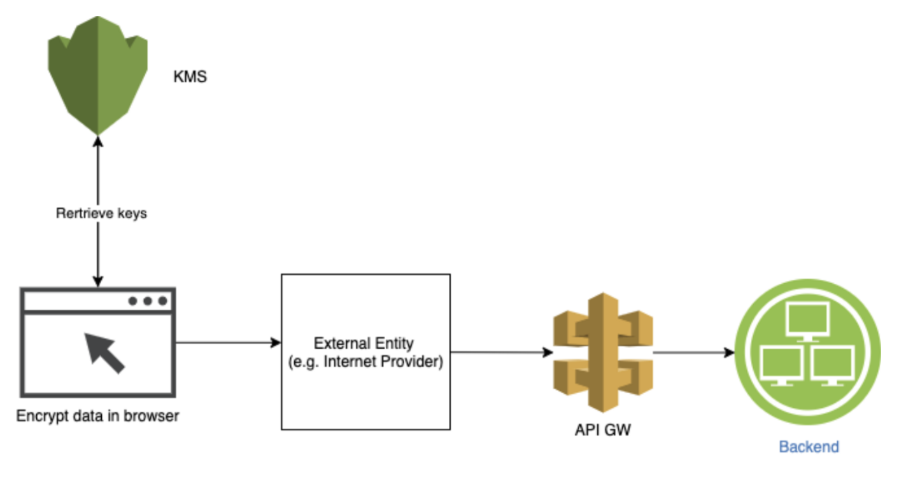

# Data Encryption in AWS (PART 2)

This post is the second and final of the series where we talk about Encryption.

We went over some encryption theory in the [first post](https://medium.com/codex/data-encryption-in-aws-part-1-dca85a0dd19) and introduced how Encryption works in AWS (server-side Encryption). In this post, we will go over client-side Encryption, which is the technique of encrypting data on the sender's side before it's sent to the server. That's mainly your application. This kind of Encryption offers a high level of privacy as it eliminates the potential for data to be viewed by service providers. For example, assume you are building a healthcare application that gathers patients data, and you would want to store that data in a database. Client-side Encryption transforms that data into cyphertext before having it sent, which helps protect it if it's lost or unintentionally exposed, as that data would be unreadable to anyone without access to the key.

In the following section, we will build together in-browser encryption, where we ensure the data won't leave the browser before it's encrypted, which makes it visible as plain-text only to the end-user.

## Building the app

Our app will be an app that gathers data such as name and age, then submits it through a POST request to our backend, which could be formed of a lambda function and a DynamoDB table. However, we will log the data to the browser console for this exercise instead of submitting a POST request. This would enable us to view the data before and after the Encryption.



We will use [parceljs](https://parceljs.org/) to bundle our front-end with minimal effort.

### Front-end without Encryption

The following steps help setup the front-end:

- Globally install the parcel-bundler. Run `npm i -g parcel-bundler` in your terminal
- Initialise your project as an npm repository: `npm init`
- Install the AWS Encryption SDK for JavaScript: `npm install @aws-crypto/client-browser`
- Create a src/index.html and src/index.js files that would form our web app
- Run `parcel index.html` command in your terminal to start the app. Open http://localhost:1234 in your browser

Now we will implement the functionality:

- Build the HTML index file:
  ```
  <html>
    <body>
        <h1>Patient data</h1>
        <br />
        <form action="" method="post" id="user-form">
        <label>Name: </label>
        <input type="text" id="name" name="name" /><br /><br />
        <label>Age: </label>
        <input type="text" id="age" name="age" /><br /><br />
        <input type="submit" value="Submit" />
        </form>
        <script src="./index.js"></script>
    </body>
  </html>
  ```
- Build the js that reads the data from the HTML form:

  ```
  const name = document.getElementById('name');
  const age = document.getElementById('age');
  const userForm = document.getElementById('user-form');

  userForm.addEventListener('submit', (e) => {
    e.preventDefault();
    console.log(name.value, age.value);
  });
  ```

  Until now, the data will be displayed in plain text.

### Front-end with Encryption

In this section, we will use AWS KMS keyring to encrypt data using the AWS Encryption SDK for JS in the browser. Keyrings are used to perform envelope encryption ([Have a look at the first part of this post](https://medium.com/codex/data-encryption-in-aws-part-1-dca85a0dd19)), where they generate, encrypt and decrypt data keys that will be used to encrypt the data in the browser.

First, we need to construct the keyring (requires a generator key and client provider), then use it to encrypt the plain text:

- Create a generator key (that's the customer master key - CMK), which will generate a data key and encrypts it

  > The following link could help decide on the type of CMK to choose: https://docs.aws.amazon.com/kms/latest/developerguide/symm-asymm-choose.html. Navigate to AWS console, and create a Symmetric-key, giving it an Alias and keeping everything else as the default. Copy the arn of the newly created key. This looks like the following: `const generatorKeyId = 'arn:aws:kms:us-east-1:248869629908:alias/awesome-key';`

* Setup a client-provider - mainly your AWS credentials - DO NOT HARDCODE THE CREDENTIALS(this is only for demo purposes)
* Create the keyring
* Encrypt the data using the created keyring

The complete code would look as follows:

```
import 'regenerator-runtime/runtime';
import {
  KmsKeyringBrowser,
  KMS,
  getClient,
  buildClient,
  CommitmentPolicy,
} from '@aws-crypto/client-browser';

const name = document.getElementById('name');
const age = document.getElementById('age');
const userForm = document.getElementById('user-form');

const { encrypt, decrypt } = buildClient(
  CommitmentPolicy.REQUIRE_ENCRYPT_REQUIRE_DECRYPT
);

const encryptData = async (plainText) => {
  const generatorKeyId = 'arn:aws:kms:us-east-1:248869629908:alias/awesome-key';
  const keyIds = [
    'arn:aws:kms:us-east-1:248869629908:key/85219ff8-edc7-4db5-a185-9b0f292163bd',
  ];

  const clientProvider = getClient(KMS, {
    credentials: {
      accessKeyId: 'sdfsdfttfff',
      secretAccessKey: 'aasdfSTYWxdsfdsdfskluoiiojssl',
    },
  });

    const keyring = new KmsKeyringBrowser({
      clientProvider,
      generatorKeyId,
      keyIds,
    });

  try {
    const result = await encrypt(keyring, plainText);
    console.log('here is the encrypted data', result);
  } catch (e) {
    console.log('something went wrong', e);
  }
};

userForm.addEventListener('submit', (e) => {
  e.preventDefault();
  console.log(name.value, age.value);
  encryptData(name.value);
});

```

Have a look at your console and see how the name gets encrypted after submission.

By doing browser encryption, we ensure that sensitive data is protected before being passed to a third party such as the internet provider or even a library that our code uses.

I hope this was helpful and keen to hear your feedback.
